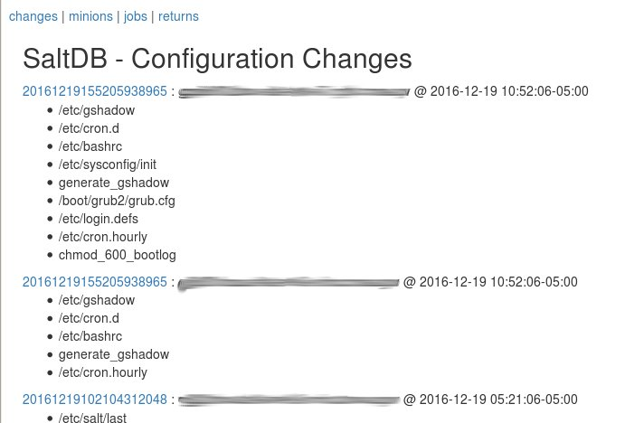
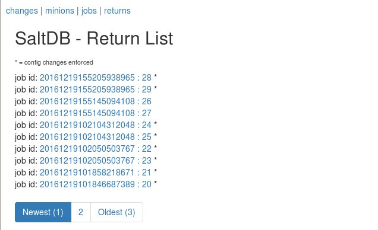
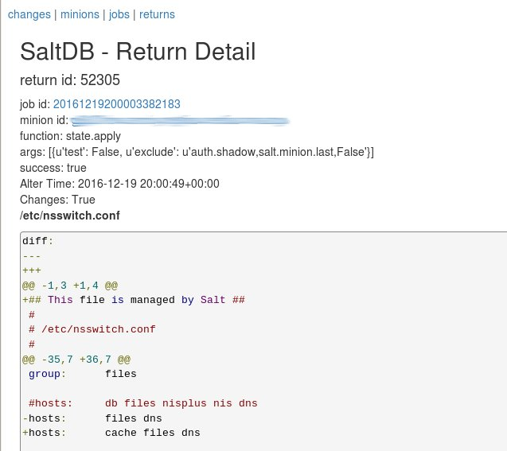

# saltdb

A basic Flask/SQLAlchemy web gui to view [salt](https://saltstack.com) minion return data and job history

 
_ _ _

_ _ _


CSS provided by the fine folks at [Bootstrap](http://getbootstrap.com/)

## FAQ
Q. Why does this exist?

A. Two reasons. 1) I wanted and excuse to try out Flask and SQLAlchemy. 2) Unless you can afford the enterprise version, salt lacks a reporting interface and I need a way to provide non salt savvy folks visibility into what changes salt is making to an infrastructure.

Q. Why did you hard code the DB credentials and the pagination count?

A. I'm lazy. But, yes, I realize that's bad form and that should go on the TODO list.

Q. Why doesn't it support job submission?

A. I don't personally care about job submission via a web gui right now. Patches are welcome!!!

## Notes
saltdb uses a lightly modified version of the upstream pgjasonb returner and associated postgresql db schema.

### Example Setup
#### 1. Install and configure a postgresql database

```
yum install postgresql95-server
su - postgres
initdb -D /var/lib/pgsql/9.5/data -U postgres
^D
service start postgresql-9.5
chkconfig --level 345 postgresql-9.5 on
createuser -DRSP -U postgres salt
createdb -O salt salt
```

```
psql -U salt -W salt < ./scripts/pgjsonb_returner.sql
```

Set up the DB connection info by editing the value of app.config['SQLALCHEMY_DATABASE_URI'] in app.py

#### 2. Configure salt-master
* First put the pgjsonb2 returner somewhere salt looks for returners:
```cp pgjsonb2.py /usr/lib/python2.6/site-packages/salt/returners/```
* Update your master config to enable the pgjsonb2 returner:
```
master_job_cache: pgjsonb2
returner.pgjsonb2.host: '127.0.0.1'
returner.pgjsonb2.user: 'salt'
returner.pgjsonb2.pass: 'salt'
returner.pgjsonb2.db: 'salt'
returner.pgjsonb2.port: 5432
```
* Restart salt-master


#### 3. Start your webserver

*Using Flask development server*
```$ python ./app.py```

*Using Apache mod_wsgi*
```
  WSGIScriptAlias /saltdb "/opt/saltdb/saltdb.wsgi"

   <Directory "/opt/saltdb">
       Options None
       AllowOverride None
       Order allow,deny
       Allow from all
   </Directory>
```
